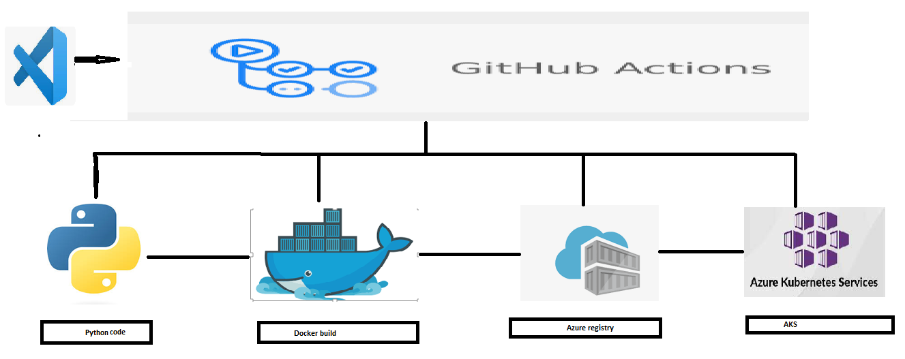

Deploying Python code to AKs using GITHUB actions.

Docker Buildx is a Docker CLI plugin that extends the functionality of the standard Docker CLI to support building images for multiple platforms, such as x86_64 and ARM architectures, in a single build.
